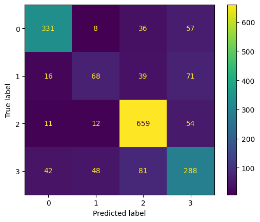
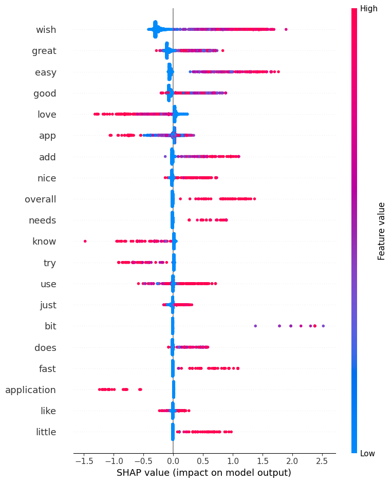

# An automated approach to classification of app reviews into Kano categories

## Aims
This project aimed to understand whether app reviews can be accurately classified into Kano categories, based on a prelabelled dataset.
The Kano model groups product features into 5 categories:
1. Basic features - considered by users to be a normal feature that they expect from the service. Leads to dissatisfaction when feature is not implementd.
2. Performance features - These features lead to satisfaction if properly implemented, and dissatisfaction if not, or improperly, implemented.
3. Delightful features - These features lead to satisfaction if implemented, but no dissatisfaction if not implemented.
4. Irrelevant features - These features have no impact on satisfaction whether implemented or not.
5. Rejection features - These features lead to dissatisfaction if not implemented. (Not used in this study as not available in the labelled dataset)

Categorising feature requests into these categories help product teams prioritise which features to build. Typically, this is a very manual process, carried out on customer feedback that has also been obtained manually. 

This project aims to build a model that is able to categorise customer reviews on app stores in order to automate both the collection and categorisation of customer requests. Once reviews are classified into different Kano model groups, the reviews can also be labelled with their topics through NLP, thus automating the creation of a prioritised feature list based on app reviews.

The project uses the labelled dataset created by by Michelle Binder, Annika Vogt, Adrian Bajraktari, and Andreas Vogelsang for their paper **Automatically Classifying Kano Model Factors in App Reviews**.

## Repo structure
The repo is structured as below:

```
capstone_project
|-- data/
|   |-- bert_embedding_approach/ --> all outputs from embedding approach
|   |-- xgboost_approach/ --> all outputs from xgboost approach
|   |-- test.csv -> train split of data
|   |-- train.csv -> test split of data
|-- notebooks/
|   |-- capstone.ipynb --> all code for project
|-- paper/
|   |-- artifacts/ --> all code and data artifacts from original paper
|   |   |-- code/
|   |   |-- datasets/ --> labelled data used for this project
|   |   |-- results/
|   |   |-- README.md
|   |-- 2303.03798v1.pdf --> original paper by Binder, Vogt, Bajraktari and Vogelsang
|-- data_sheet.md
|-- model_card.md
|-- requirements.txt

```

## Approaches and findings
As part of this project, two approaches were tested for classification.These are outlined below.
The baseline accuracy was 40%, if all reviews were classified as Irrelevant - the most common class.

### Embedding approach
The first approach created embeddings for each review in the training set using BERT, found the centroid for each label, based on the embeddings, and assigned each new review a label based on the closest centroid.

This seemed like a reasonable approach as LLMs are well known for capturing the meaning from text, and this could be useful for capturing the nuances of language used in the reviews.

This approach improved on the baseline approach, with an accuracy of 68% on both the train and test set, with an weighted average precision and recall of 68% and 72% resepectively, on both the train and test sets.

This is mostly affected by poor performance on the "Delightful features" category, which often gets misclassified as "Irrelevant" or "Performance" features, as seen in the confusion matrix below for the test set.

**Label key:**
```
0 --> Basic feature
1 --> Delightful feature
2 --> Irrelevant feature
3 --> Performance feature
```


Further investigation into how well the embeddings lead to well defined clusters suggests that the mean distance for each embedding from the centroid of its cluster is higher than the mean distance between the centroids of the different clusters. This suggests that the clusters created from the embeddings, as represented by the centroids, are not very well defined. This makes sense as clusters may be better defined by the topic of / feature in the review than by the Kano labelling.

### XGBoost approach
The second approach built an XGBoost model, using TFIDF to create the required features from the reviews. This was chosen as XGBoost is an industry leading model, and is inherently explainable.

This approach improved on the baseline approach and embedding approach, with an accuracy of 74% on the test set, and a weight average precision and recall of 73% and 74% respectively.

The performance on the training set, however, was 92% suggesting that the model may currently be overfitting. Further work can be done to identify how to improve this.

With this appraoch, the misclasification of the "Delightful feature" category was reduced, with them only being misclassifed as "Performance features" now. This makes sense as both are likely to use inherently positive language when features are well implemented.

This is demonstrated in the performance matrix below:

**Label key:**
```
0 --> Basic feature
1 --> Delightful feature
2 --> Irrelevant feature
3 --> Performance feature
```



The shap plots below help explain why a particular review me be classified as reference a feature that is Basic, Performance, Irrelevant or Delightful. The summary plot highlights for example that "Crashes" is often used to categorise a review a "Basic". This makes sense as an app running properly is an expected feature, that will cause disatisfaction when not working/crashing. Similarly, "freezes" is used for categorizing as "Basic" or "Irrelevant". 


The more detailed breakdowns into each class are below. These show for example that: 
- if a review contains a high portion of the word "Crashes" or "Fix" or "Crashing" or "Freezes" its more likely to be classified as referencing a Basic feature
- if a review contains a high portion of the word "Love" or "Great" or "Best" or "Good" its less likely to be classied as referencing a Basic feature
- if a review contains a high portion of the word "Open" or "Working" or "Work" or "Update" its more likely to be classified as referencing a Basic Feature
- if a review contains a high portionof the word "Love" or "Great" or "Wish" or "Best" or "Awesome" its more likely to be classified as referencing a Delight feature
- if a review contains high portion of the word "Overall" or "Needs" or "Add" or "Does" then its more likely to be classified as referencing a Performance feature

#### Shap plot for Basic features


#### Shap plot for Delightful features


#### Shap plot for Irrelevant features


#### Shap plot for Performance features


