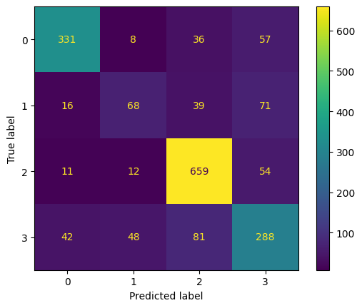

# Model Card

## Model Description (for XGBoost Model)

**Input:** 

The model uses a labelled dataset of app reviews created by Stanik, Haering and Maalej and labelled by Binder, Vogt, Bajraktari and Vogelsang.
There are 6070 reviews overall, collected from the Apple App Store and Google Play Store. 
All reviews were manually labelled according to the Kano model, considering only the review text, and no further context on the app.
Each review was only assigned one label, even if the review mentions multiple features. If multiple features are mentioned in the review, the feature that was most prominent was used for labelling.
The labelling was done by two independent researchers, with a tie break labeler where ther was disagreement between the two labellers.

There was a 30% stratified sample created from this dataset for testing, and the rest of the data was used for training.

Features were created using TFIDF trained on the training dataset, removing all english stopwords via sklearn.

**Output:** 

The model outputs a label for each provided review text.
The labels are as below: 

```
0 --> Basic feature
1 --> Delightful feature
2 --> Irrelevant feature
3 --> Performance feature
```

**Model Architecture:**

An XGBoost architecture is used, with the following settings:

```
XGBClassifier(base_score=None, booster=None, callbacks=None, colsample_bylevel=None, colsample_bynode=None, colsample_bytree=None, device=None, early_stopping_rounds=None, enable_categorical=False, eval_metric=None, feature_types=None, gamma=None, grow_policy=None, importance_type=None, interaction_constraints=None, learning_rate=None, max_bin=None, max_cat_threshold=None, max_cat_to_onehot=None, max_delta_step=None, max_depth=None, max_leaves=None, min_child_weight=None, missing=nan, monotone_constraints=None, multi_strategy=None, n_estimators=None, n_jobs=None, num_class=4, num_parallel_tree=None, object="multi:softmax")
```

## Performance

Performance is measured on an unseen 30% stratified sample of the data.
The model had an accuracy of 74%, and a weighted average precision and recall of 73% and 74% respectively.

Find below the confusion matrix.
**Label key:**
```
0 --> Basic feature
1 --> Delightful feature
2 --> Irrelevant feature
3 --> Performance feature
```




## Limitations

A major limitation of this model is that it is limited by the range of words used in the training dataset.
Binder, Vogt, Bajraktari and Vogelsang show that this can mean that when run on a different dataset within the same domain, performance can degrade quite quickly, partly due to language changing over time, partly because what category a feature falls in can change over time.
Its unclear what categories of apps the original dataset was built on so its difficult to say which categories of apps this model works best on.

## Trade-offs

The model performs less well on "Delightful" features due to the relatively fewer samples available for this category.
